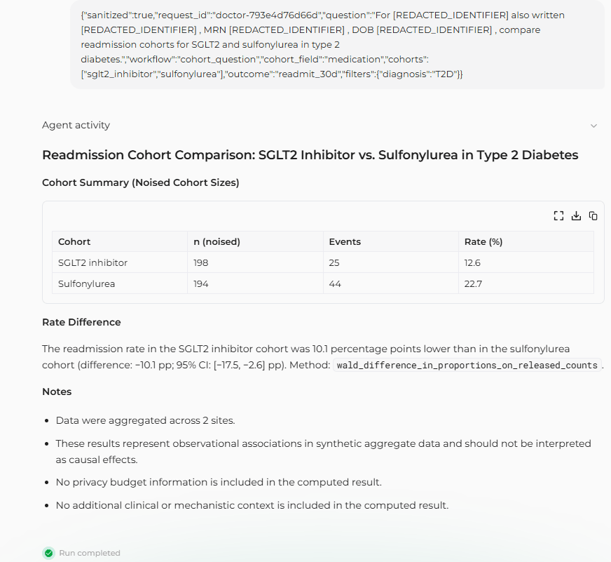
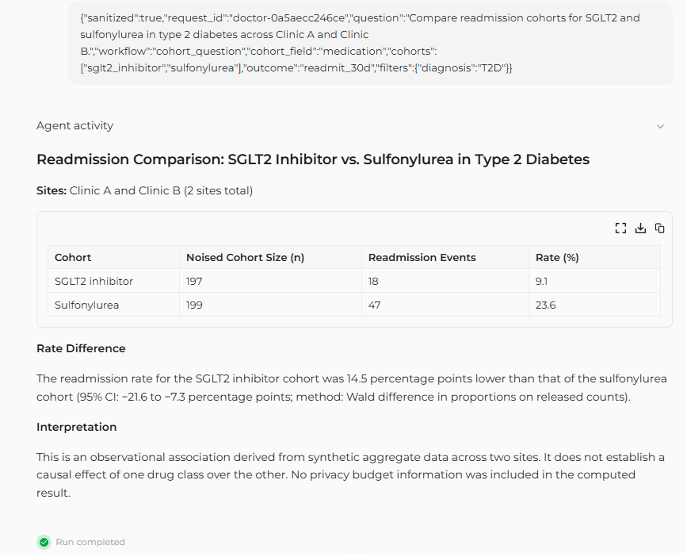
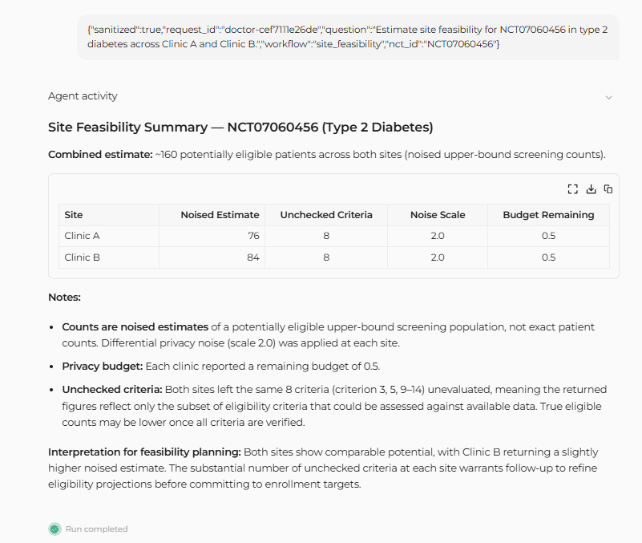
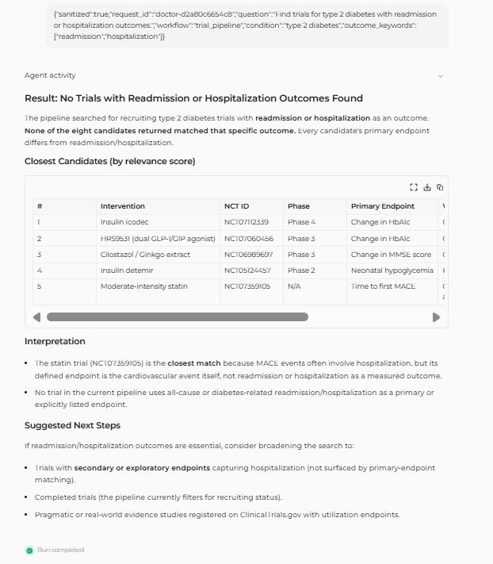
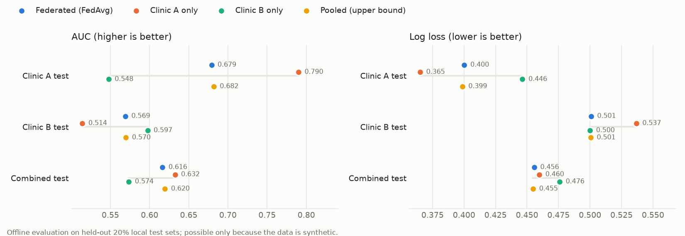

# CohortGuard

CohortGuard is a Flower AgentApp demo for privacy-preserving, federated clinical-research coordination over synthetic data.

## Phase 2 architecture

- **Doctor Agent:** local desktop app on Clinic A's side. Raw doctor text stays local. The Doctor Agent scrubs Clinic A names, MRNs, DOBs, planted canaries, date/ID patterns, and person-name patterns before submitting a structured de-identified request.
- **Coordinator:** one AgentApp running at the SuperLink. It validates de-identification, discovers and pins SuperNode roles, routes workflows in code, pools aggregate results, and optionally asks a model to write only the final summary.
- **SuperNodes:** three role-configured nodes selected through `node_config` and discovered with `identify_role`:
  - `clinic_a`
  - `clinic_b`
  - `research`

Clinic nodes release only privacy-gated aggregates. Patient-level results are local-only in the Clinic A Doctor Agent.

## Phase 2 SuperGrid result

Final SuperGrid demo used model:

```text
flwrlabs/endeavor-1.0
```

Run IDs:

| Workflow | SuperGrid run ID |
|---|---:|
| Cohort question | `300229704695635665` |
| Trial pipeline | `9802931396676563660` |
| Site feasibility | `2808782358741742845` |
| Maria scrubbed cohort | `3547292561572019840` |

Canary scan result across streamed SuperGrid events, local logs, and model input/output boundaries:

```text
canary hits: 0
```

The SGLT2 inhibitor vs sulfonylurea cohort workflow recovered the planted synthetic effect direction: the sulfonylurea cohort had a higher noised 30-day readmission rate than the SGLT2 inhibitor cohort. This is an observational aggregate comparison over synthetic data, not a causal estimate.
## Live on SuperGrid

These are screenshots of real coordinator runs on Flower SuperGrid (model: `flwrlabs/endeavor-1.0`), not mockups.

**Identifiers never reach the coordinator.** The doctor agent scrubs Maria's name, alternate name, MRN and date of birth inside Clinic A before anything is sent. The coordinator receives `[REDACTED_IDENTIFIER]` placeholders and the analysis still runs.



**Cohort comparison across two clinics,** from noised, privacy-gated counts, with the rate difference and confidence interval computed in code. Observational, on synthetic data; it recovers the direction of the effect planted in the data generator.



**Site feasibility:** trial criteria go into each clinic; only noised upper-bound counts come back.



**Trial pipeline:** every candidate verified against ClinicalTrials.gov; the summary says plainly when no trial matches the outcome of interest.



## Local/SuperGrid helper scripts

Useful scripts:

```shell
# Main demo: cohort question, Maria (redacted and released), trial pipeline, feasibility = 4.5 of 5.0 budget
scripts/start_local_grid.sh --session demo-main-001
PYTHONUTF8=1 coordinator/.venv/Scripts/python.exe scripts/run_local_demo.py --demo main
scripts/stop_local_grid.sh

# SGLT2 suppression example on its own fresh session: suppressed for small counts, not an empty budget
scripts/start_local_grid.sh --session demo-sglt2-001
PYTHONUTF8=1 coordinator/.venv/Scripts/python.exe scripts/run_local_demo.py --demo sglt2_suppression
scripts/stop_local_grid.sh

# Clinic attack suite (offline, seeded): differencing on Maria, direct extraction, tiny cohorts, budget exhaustion
PYTHONUTF8=1 coordinator/.venv/Scripts/python.exe scripts/run_clinic_attack_suite.py
```

For SuperGrid:

```shell
scripts/start_supergrid_nodes.sh --session supergrid-demo-001
PYTHONUTF8=1 coordinator/.venv/Scripts/python.exe scripts/run_supergrid_demo.py \
  --federation @praven1/cohortguard-phase2 \
  --expected-role-node-ids '{"clinic_a":"...","clinic_b":"...","research":"..."}'
scripts/stop_local_grid.sh
```

On Windows, use Git Bash for the start scripts. PowerShell can split Flower's quoted `--node-config` argument incorrectly. Use `PYTHONUTF8=1` for Flower commands to avoid Windows console encoding issues.

## Phase 4: federated readmission model

The privacy gate correctly suppresses SGLT2 cohort queries at this data size, because per-clinic event counts fall below 10 after noise. [fl-readmission/](fl-readmission/README.md) takes a different route. A separate Flower ServerApp/ClientApp trains a 30-day readmission logistic regression with FedAvg across Clinic A and Clinic B, and only model weights plus a few aggregate metrics leave each clinic.

- **Node selection:** the ServerApp addresses only the two pinned clinic SuperNodes, and the research SuperNode never receives a task.
- **Result:** the federated model nearly matches the pooled upper bound (combined test AUC 0.616 vs 0.620, log loss 0.4557 vs 0.4548). It recovers the planted SGLT2 direction: adjusted odds ratio 0.58, where the pooled reference is 0.58 with 95% CI 0.36–0.93.
- **Canary scan:** 0 hits across FL messages, events and logs.



## Known limitations

- **Synthetic data only:** all clinical records are synthetic and intended for demo/testing.
- **No regulatory claim:** this is not a HIPAA/compliance product.
- **Salted canary hashes:** the coordinator ships salted SHA-256 hashes of planted canary values instead of plaintext canaries. Because the salt ships with the hashes, low-entropy values such as DOBs and MRNs could be brute-forced; this is bundle hygiene and regression protection, not a cryptographic privacy guarantee.
- **Budget per session:** privacy ledgers persist by session path. The main four-workflow demo spends 2.0 + 2.0 + 0.5 = 4.5 of 5.0 budget per clinic; the SGLT2 suppression example runs in its own session. Scripts create new ledger filenames with `--session`; they never auto-delete or reset ledgers. Ledgers fail closed: only the start scripts create a new session at zero spent, and a missing, corrupted or unreadable ledger during a session refuses every release.
- **Noisy aggregates:** clinic counts are privacy-gated/noised and must not be interpreted as exact patient counts.
- **Federated model updates reveal aggregates:** "only weights leave" does not mean nothing sensitive leaves.
  - A clinic's first-round logistic-regression update is close to its per-feature sums of (label − ½)·feature. For SGLT2 users that is roughly "readmissions − n/2" at that clinic: the kind of count the privacy gate noises and suppresses, but here it is **un-noised**.
  - Each clinic sends no update for features held by fewer than 10 of its patients (the FL analogue of the minimum cell size). That rule adds no noise and does not protect feature combinations.
  - The server sees each clinic's update individually, and FL runs are not charged to the clinic ledgers.
  - Patient-level DP-SGD with privacy accounting is future work. See [fl-readmission/README.md](fl-readmission/README.md#privacy).

## Project areas

- [coordinator/](coordinator/README.md): Phase 2 coordinator AgentApp and SuperNode role handlers.
- [doctor-agent/](doctor-agent/README.md): Clinic A-local Doctor Agent.
- [clinic-agents/](clinic-agents/README.md): synthetic clinic data, privacy gate, original clinic AgentApps.
- [research-agent/](research-agent/README.md): public evidence/trial pipeline and replay cache.
- [fl-readmission/](fl-readmission/README.md): Phase 4 federated readmission model (Flower ServerApp + ClientApp).
