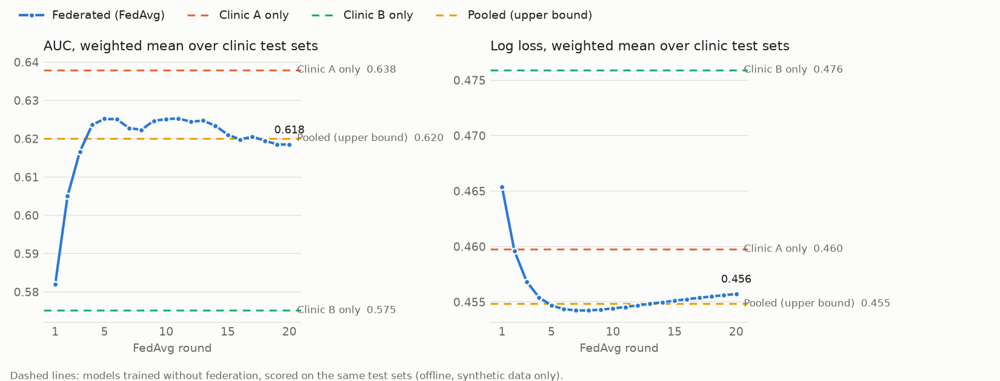

# CohortGuard FL readmission

A Flower federated-learning app (ServerApp + ClientApp, publisher `praven1`) that learns a 30-day readmission-risk model across Clinic A and Clinic B. Each clinic trains on its own records, and only model weights plus a few aggregate metrics leave it. It is a separate Flower app from the coordinator AgentApp because the two cannot share a bundle.

**Why FL here:** at this data size the privacy gate correctly suppresses cohort queries on SGLT2 users, because per-clinic event counts fall below 10 after noise. A model trained where the data lives can still learn the association without releasing those counts.

All data is synthetic. This is not a clinical model and makes no regulatory claim.

## How it works

- **Model:** L2-regularised logistic regression written in NumPy. Each round runs full-batch gradient descent locally, then FedAvg weighted by training-set size. Settings: 20 rounds × 10 local epochs, learning rate 1.0, L2 1e-3. These were tuned once and then frozen.
- **Features (21):** age, HbA1c, eGFR and BMI, each scaled with **fixed clinical constants that are never derived from data**: (age − 60)/20, (HbA1c − 8)/2, (eGFR − 80)/25, (BMI − 30)/6. Also a sex indicator, and multi-hot diagnosis codes, current medication classes and prior medication classes from `shared/allowlist.py`. The label is `readmitted_30d`.
- **Identifiers:** the loader reads only an explicit field list. It never touches `mrn`, `name` or `dob`.
- **Local split:** each clinic holds out a stratified 20% test set, using a fixed seed (`split-seed`).
- **Where data comes from:**
  - **Deployment:** each ClientApp reads only the `data-path` in its own SuperNode `node_config`, the same one the clinic SuperNodes already use. The filename must match the node's `role`. Run config can never redirect a deployment node.
  - **Simulation:** partition 0 is Clinic A and partition 1 is Clinic B, under run config `sim-data-dir`.
- **Only clinics get tasks.** Run config `clinic-node-ids` pins the two clinic SuperNode IDs.
  - The ServerApp wraps its `Grid` in `ClinicOnlyGrid`. That wrapper reports only the pinned IDs to FedAvg and refuses any message addressed elsewhere.
  - Every reply's source, role claim, record keys, metric keys and array shapes are checked against an allowlist. Any mismatch, missing clinic or error reply aborts the run.
  - A ClientApp on a non-clinic node, such as the research SuperNode, refuses.
  - `clinic-node-ids = "{}"` is accepted only with `simulation = true`, and then only with exactly two nodes.
- **Minimum cell size for updates:** each clinic freezes, and so sends no update for, any binary feature held by fewer than 10 of its training patients. This is the FL analogue of the privacy gate's minimum cell size. The threshold is fixed in client code, so the server cannot lower it. In this data it freezes `prior_metformin` at Clinic A (9 patients).

## Commands

```shell
cd fl-readmission
uv sync --all-groups                      # Python 3.12 venv incl. dev tools (Ray for simulation needs <3.13 on Windows)
python ../scripts/sync_apps.py            # vendors shared/allowlist.py into this app
PYTHONUTF8=1 .venv/Scripts/python.exe -m pytest -q tests

# Simulation: two simulated clinic nodes
PYTHONUTF8=1 .venv/Scripts/python.exe run_experiment.py simulation

# Local deployment: SuperLink + clinic A + clinic B + research SuperNode (from the repo root, Git Bash)
scripts/start_local_grid.sh --session fl-local-<new>
grep "SuperNode ID" runtime-logs/clinic_a.err.log runtime-logs/clinic_b.err.log
cd fl-readmission
PYTHONUTF8=1 .venv/Scripts/python.exe run_experiment.py local \
  --clinic-node-ids '{"clinic_a":"<clinic-a-id>","clinic_b":"<clinic-b-id>"}'
../scripts/stop_local_grid.sh
```

**SuperGrid (deployment demonstration).** In Flower 1.39 the ServerApp runs as one task for the whole run, so a per-task time limit on SuperGrid also bounds the whole run.
- Locally, round 1 takes about 40 s and each later round about 34 s, so 20 rounds take about 11 minutes.
- The SuperGrid run therefore uses 5 rounds (about 3 minutes locally), chosen from timing alone.
- It is labeled a deployment demonstration, and the 20-round local run remains the reported result.

```shell
scripts/start_supergrid_nodes.sh --session fl-supergrid-<new>      # from the repo root, Git Bash
flwr supernode list supergrid --verbose --format json            # read the clinic node IDs
cd fl-readmission
PYTHONUTF8=1 .venv/Scripts/python.exe run_experiment.py supergrid --rounds 5 \
  --federation @praven1/<federation> \
  --clinic-node-ids '{"clinic_a":"<clinic-a-id>","clinic_b":"<clinic-b-id>"}'
```

`run_experiment.py` does the following:
1. Streams the run and parses the ServerApp's single `FL_RESULT` line.
2. Writes `results/fl_results.json`.
3. Runs the offline comparison and draws `docs/media/fl-readmission-*.png`.
4. Checks that only the two clinic nodes were addressed.
5. Runs the canary scan.

It exits nonzero on any canary hit or on a node-selection violation.

## Results

These results are from the 20-round local deployment. The simulation produced identical weights.

### Headline: SGLT2 inhibitors

**Clinic A's data alone cannot separate the SGLT2 effect from zero. The federated model finds an odds ratio of 0.58, matching the pooled estimate.**

| Model | Coefficient | Odds ratio | 95% CI (odds ratio, Wald) | Separates from zero? |
|---|---|---|---|---|
| **Federated** | −0.547 | **0.58** | not computed (see pooled) | matches pooled |
| Pooled (upper bound) | −0.550 | 0.58 | 0.36 – 0.93 | yes |
| Clinic A only | −0.278 | 0.76 | 0.37 – 1.56 | **no** (CI includes 1) |
| Clinic B only | −0.795 | 0.45 | 0.23 – 0.89 | yes |

- **Planted effect:** `generate_data.py` lowers the readmission probability of current `sglt2_inhibitor` users by 0.07 (absolute). The raw training data shows 11.7% for users (n=180) vs 19.5% for non-users (n=754).
- **Direction:** the federated model recovers the planted direction. SGLT2 use is associated with lower adjusted odds of 30-day readmission.
- **Magnitude:** the odds ratio is adjusted for the other features and is on a different scale from the planted additive −0.07. It should not be read as recovering the planted size.
- **Not causal:** this is an observational association in synthetic data.

### Prediction: federated vs clinic-only vs pooled

The comparison below can see both clinics' test sets. That is possible **only because the data is synthetic**, and the pooled model is an upper bound a real deployment could not train. AUCs carry seeded bootstrap 95% intervals. The test sets are small: 105 patients with 16 readmissions at A, 129 with 26 at B.

| Model | AUC Clinic A test | AUC Clinic B test | AUC combined | Log loss combined |
|---|---|---|---|---|
| **Federated (FedAvg)** | 0.679 [0.520, 0.827] | 0.569 [0.434, 0.695] | 0.616 [0.512, 0.710] | **0.4557** |
| Clinic A only | 0.790 [0.657, 0.898] | 0.514 [0.392, 0.626] | 0.632 [0.537, 0.720] | 0.4598 |
| Clinic B only | 0.548 [0.378, 0.724] | 0.597 [0.476, 0.712] | 0.574 [0.474, 0.673] | 0.4759 |
| Pooled (upper bound) | 0.682 [0.522, 0.834] | 0.570 [0.435, 0.697] | 0.620 [0.515, 0.713] | 0.4548 |

- **Federated vs pooled:** the federated model matches the pooled model on both AUC (0.616 vs 0.620 combined) and log loss (0.4557 vs 0.4548).
- **Federated vs each clinic alone:** it has better log loss than either clinic alone (0.4557 vs 0.4598 and 0.4759).
- **AUC differences between all four models are within noise.** Every interval overlaps. That includes Clinic A only's 0.790 on its own test set, which rests on 16 readmissions.
- **Overall AUC is modest (about 0.6) on this synthetic data.** The generator puts little readmission signal in these features, so this is not a useful risk model. The point is the comparison and the SGLT2 association.



The weighted AUC peaks around round 5 (0.625), then eases to 0.618 by round 20 while test loss rises slightly (mild overfitting). The number of rounds was fixed in advance, so the reported model is round 20, not the best round.


## Runs

| Run | Nodes | Outcome |
|---|---|---|
| Simulation | 2 simulated clinic nodes | 20 rounds; canary hits 0 |
| Local deployment | SuperLink + Clinic A + Clinic B + **research** SuperNode; only the clinic IDs pinned | 20 rounds; final weights **identical** to the simulation; canary hits 0 across 12 sources |

**Research node exclusion, local deployment:**
- The SuperLink logged 40 replies from each clinic node (20 train + 20 evaluate) and none from any other node.
- The clinic SuperNode logs show 40 received messages each. The research SuperNode log shows **0**.
- The ServerApp addressed only the two pinned clinic IDs.

## Privacy

**Canary scan:** every run scans the streamed Flower output, `runtime-logs/*.log` (SuperLink and all three SuperNodes in deployment), the reply structure log and `fl_results.json`. It checks for every patient's MRN and name at both clinics, every planted canary's DOB formats, and the record keys `mrn`/`name`/`dob`.

**Known limits (read before relying on this):**

- **Model updates reveal aggregates.** Starting from a zero model, a clinic's first update is close to its per-feature sums of (label − ½)·feature. For a binary feature such as `current_sglt2_inhibitor`, that is roughly "readmissions − n/2 among SGLT2 users" at that clinic: **the kind of count the privacy gate noises and suppresses, but here it is un-noised.**
  - The minimum-cell rule above removes updates for features held by fewer than 10 patients.
  - It does not add noise, and it does not protect combinations of features.
  - With 22 parameters, coarse features and hundreds of patients per clinic, reconstructing an individual record is unlikely. It is still not impossible.
- **The server sees each clinic's update individually** (no secure aggregation). With only two clinics, secure aggregation would add little: each clinic could subtract its own update from the sum.
- **Other released values:** exact training and test sizes (`num-examples`) and per-clinic test AUC and log loss are also released each round.
- **No ledger charge:** FL runs are not charged to the clinic privacy ledgers.
- **Future work:** patient-level differential privacy via DP-SGD inside each clinic (per-record gradient clipping plus Gaussian noise) with privacy accounting. Flower's client-side fixed-clipping DP was deliberately not used: with two clients it protects whole clinics, not patients, at a large utility cost.
